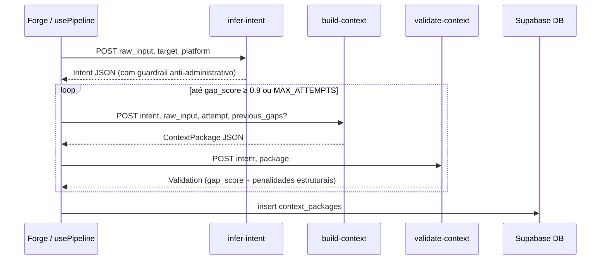

# Engenharia — context-forge

Documento **curto e orientado a fluxos**. Atualizar quando mudar comportamento de produto ou de infra.

## Visão do produto

Aplicação web para **engenharia de contexto de alto nível**: o utilizador escreve um pedido bruto, escolhe a plataforma-alvo, e o **pipeline** no Supabase produz um **pacote de contexto** estruturado, valida com **gap score** e pode refinar em loop até atingir qualidade de produção. Resultados são guardados no **Cofre**; a **Forja** é o workspace principal.

| Conceito de produto | Código / página |
|---------------------|-----------------|
| Landing pública | [`src/pages/Landing.tsx`](../src/pages/Landing.tsx) |
| Auth (email/senha) | [`src/pages/Auth.tsx`](../src/pages/Auth.tsx) |
| Forja (pipeline + preview) | [`src/pages/Forge.tsx`](../src/pages/Forge.tsx) |
| Cofre (lista de pacotes) | [`src/pages/Vault.tsx`](../src/pages/Vault.tsx) |

---

## Stack

| Camada | Tecnologia |
|--------|------------|
| Build | Vite 8, TypeScript |
| UI | React 19, Tailwind CSS 4 (`@tailwindcss/vite` em [`vite.config.ts`](../vite.config.ts)) |
| Rotas | react-router-dom |
| Dados remotos / cache | TanStack Query, `@supabase/supabase-js` |
| Contratos runtime | Zod ([`src/lib/contract.ts`](../src/lib/contract.ts)) |
| Pipeline cliente | [`src/hooks/usePipeline.ts`](../src/hooks/usePipeline.ts) |
| Feedback | sonner |

**Dark mode:** classe `dark` em `html` ([`index.html`](../index.html)); variante Tailwind `@custom-variant dark` em [`src/index.css`](../src/index.css).

---

## Frontend — rotas e autenticação

Definidas em [`src/App.tsx`](../src/App.tsx):

- `/` — Landing
- `/auth` — Login / registo
- `/forge`, `/vault` — Por baixo de [`ProtectedRoute`](../src/components/ProtectedRoute.tsx) + [`AppShell`](../src/components/AppShell.tsx) (navbar)

Sessão: [`AuthProvider`](../src/context/AuthProvider.tsx) + [`useAuth`](../src/hooks/useAuth.ts). O cliente Supabase está em [`src/integrations/supabase/client.ts`](../src/integrations/supabase/client.ts).

---

## Contrato compartilhado (Zod)

Ficheiro canónico: [`src/lib/contract.ts`](../src/lib/contract.ts).

- **`Platform`**, **`TaskType`** — enums usados no UI (chips, seletor).
- **`IntentSchema`** — output de `infer-intent`. Campos: `role`, `objective`, `public`, `constraints`, `domain`, `task_type`, `target_platform`, `implicit_assumptions`.
- **`ContextPackageSchema`** — output de `build-context`. Inclui `system_immutable`, `task_routing`, `assumptions`, `intent`, `user_data`, `retrieval` (docs + exemplars), `contract` (role, objective, inputs, steps, tools, output_format, acceptance_criteria, stop_condition, fallback, self_check).
- **`ValidationSchema`** — output de `validate-context` (`gap_score`, `gaps`, `decision`, `notes`).
- **`PipelineEventSchema`** — união discriminada para o drawer de eventos na UI.
- **`GAP_THRESHOLDS`** — `ACCEPT` (≥ 0.9), `REFINE_PARTIAL` (≥ 0.5); abaixo disso → `refine_full`.

---

## Pipeline (cliente → Edge Functions)

Orquestrador: **`usePipeline`** ([`src/hooks/usePipeline.ts`](../src/hooks/usePipeline.ts)).

Fases: `idle` → `inferring_intent` → `building_context` → `validating` → (`refining` em novas tentativas) → `done` | `error`.

### Edge Functions (Supabase)

| Nome | Método | Modelo | Papel |
|------|--------|--------|-------|
| `infer-intent` | POST JSON | gpt-4o-mini | Extrai intenção estruturada do raw_input. Inclui guardrail pós-parse: se `objective` for administrativo, força re-extração automática. |
| `build-context` | POST JSON | gpt-4o | Monta pacote canônico. Em refinamentos (`attempt > 0`), recebe `previous_gaps` com os problemas específicos do último ciclo para correção direcionada. |
| `validate-context` | POST JSON | gpt-4o | Valida qualidade em dois estágios: (1) penalidades estruturais objetivas em código (contagem de docs, steps, criteria), depois (2) avaliação subjetiva pelo LLM. Score final = LLM score + penalidades estruturais. |

URLs: `{VITE_SUPABASE_URL}/functions/v1/{nome}`.

Headers: `Authorization: Bearer <access_token>` + `apikey: <anon>`.

### Princípios de qualidade do pipeline

**Anti-genérico:** o sistema aplica múltiplas camadas para evitar outputs genéricos:
1. `infer-intent`: separação CAMADA ADMINISTRATIVA vs CAMADA DE PRODUTO; re-extração automática se objective for administrativo
2. `build-context`: instrução explícita anti-slot-filling; `user_data.content` sintetiza sem copiar verbatim; `retrieval.docs` deve ter um item por regra/spec do input (perda de informação é erro crítico)
3. `validate-context`: penalidades estruturais em código (`retrieval.docs` vazio → -0.4, `steps < 2` → -0.2, frases genéricas → -0.25) + avaliação LLM com gpt-4o

**Refinamento direcionado:** `usePipeline` passa `previous_gaps` (lista de problemas específicos da última validação) para `build-context` nos ciclos de refinamento, em vez de instrução genérica.

### Refinamento

Até **`MAX_ATTEMPTS = 2`** iterações (constante em `usePipeline.ts`). A cada ciclo:
- `gap_score >= 0.9` → aceita e encerra
- `gap_score < 0.9` e tentativas restantes → `attempt++`, envia `previous_gaps` para `build-context`, refaz

`build-context` usa `AbortSignal.timeout(120_000)` na chamada OpenAI para evitar que a Edge Function pendurada seja abortada pelo Supabase sem retornar resposta.

### Diagrama de fluxo

---

## Persistência — tabela `context_packages`

O insert no cliente ([`usePipeline.ts`](../src/hooks/usePipeline.ts)) usa variáveis locais do callback (`intent`, `contextPackage`, `lastValidation`) — não `state.*` — para evitar stale closure.

Colunas: `user_id`, `raw_input`, `intent_json`, `package_json`, `validation_json`, `target_platform`, `task_type`.

Listagem no Cofre: [`useVaultPackages`](../src/hooks/useVaultPackages.ts) — `select *` filtrado por `user_id`, ordenado por `created_at`. **RLS** no Supabase restringe leitura/escrita ao dono.

---

## Variáveis de ambiente

| Variável | Uso |
|----------|-----|
| `VITE_SUPABASE_URL` | Cliente Supabase + URLs das Edge Functions |
| `VITE_SUPABASE_ANON_KEY` | Cliente Supabase + header `apikey` nas functions |

Secrets das Edge Functions (Supabase → Edge Functions → Secrets):

| Secret | Uso |
|--------|-----|
| `OPENAI_API_KEY` | Backend ativo (temporário, enquanto Anthropic sem créditos) |
| `ANTHROPIC_API_KEY` | Backend principal (Claude 3.5 Sonnet) — reativar quando créditos disponíveis |

---

## CI/CD — GitHub Actions

Workflow: [`.github/workflows/deploy-functions.yml`](../.github/workflows/deploy-functions.yml).

Dispara em push para `main` com alterações em `supabase/functions/**`. Deploya as 3 funções via Supabase CLI.

Secrets necessários no GitHub:
- `SUPABASE_ACCESS_TOKEN` — token de acesso da conta Supabase
- `SUPABASE_PROJECT_REF` — ref do projeto (sem espaços, ex: `qgwglyianvvchuvflkui`)

---

## Formatadores de plataforma

[`src/lib/formatters.ts`](../src/lib/formatters.ts) converte o `ContextPackage` para o formato nativo de cada plataforma:

| Plataforma | Formato | Label no UI |
|------------|---------|-------------|
| `claude` | XML tags (`<system>`, `<context>`, `<contract>`) | Copiar como XML |
| `gpt` | Markdown com seções | Copiar como Markdown |
| `cursor` | `.cursorrules` | Copiar .cursorrules |
| `system-prompt` | Texto limpo | Copiar System Prompt |
| `agente` | ReAct (Thought/Action/Observation) | Copiar para Agente |

---

## Dívida conhecida

1. **Schema sem validação de especificidade** (`contract.ts`): campos como `system_immutable`, `steps`, `output_format` usam `z.string()` sem checar conteúdo genérico. Uma validação Zod rigorosa bloquearia placeholders antes de chegarem ao validador.
2. **task_type híbrido**: inputs que combinam REASONING + EXTRACTION são forçados a uma categoria. Impacto: estratégia errada no `STRATEGY_MAP`.
3. **Diminishing returns no refinamento**: não há detecção de melhoria mínima entre ciclos (ex: score 0.82 → 0.83 não justifica nova chamada).
4. **Validador pode inflar score em casos edge**: mesmo com gpt-4o, avaliação subjetiva pode ser leniente. As penalidades estruturais em código mitigam, mas não eliminam completamente.

---

## Como manter este doc

- Alterou comportamento do pipeline (novas fases, novos campos, novos modelos)? → Atualizar **Pipeline** e **Contrato**.
- Alterou lógica anti-genérico (prompts, guardrails, penalidades)? → Atualizar **Princípios de qualidade do pipeline**.
- Nova variável de ambiente ou secret? → Atualizar **Variáveis de ambiente**.
- Nova rota ou auth? → **Frontend — rotas**.
- Nova tabela ou colunas? → **Persistência**.

Preferir links para ficheiros em vez de blocos de código.
