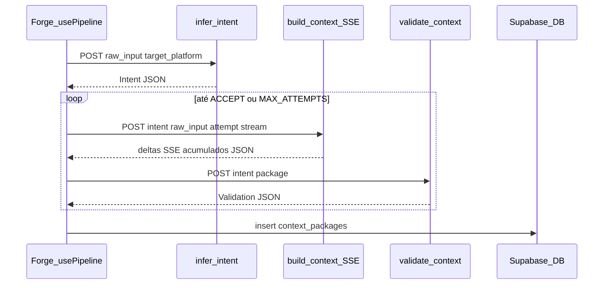

# Engenharia — prompt.do (context-forge)

Documento **curto e orientado a fluxos**. Atualizar quando mudar comportamento de produto ou de infra.

## Visão do produto

Aplicação web para **engenharia de contexto**: o utilizador escreve um pedido bruto, escolhe a plataforma-alvo, e o **pipeline** no Supabase produz um **pacote de contexto** estruturado, valida com **gap score** e pode refinar em loop. Resultados são guardados no **Cofre**; a **Forja** é o workspace principal.

| Conceito de produto | Código / página |
|---------------------|-----------------|
| Landing pública | [`src/pages/Landing.tsx`](../src/pages/Landing.tsx) |
| Auth (email/senha) | [`src/pages/Auth.tsx`](../src/pages/Auth.tsx) |
| Forja (pipeline + preview) | [`src/pages/Forge.tsx`](../src/pages/Forge.tsx) |
| Cofre (lista de pacotes) | [`src/pages/Vault.tsx`](../src/pages/Vault.tsx) |

---

## Stack

| Camada | Tecnologia |
|--------|------------|
| Build | Vite 8, TypeScript |
| UI | React 19, Tailwind CSS 4 (`@tailwindcss/vite` em [`vite.config.ts`](../vite.config.ts)) |
| Rotas | react-router-dom |
| Dados remotos / cache | TanStack Query, `@supabase/supabase-js` |
| Contratos runtime | Zod ([`src/lib/contract.ts`](../src/lib/contract.ts)) |
| Pipeline cliente | [`src/hooks/usePipeline.ts`](../src/hooks/usePipeline.ts), [`src/hooks/useSSEStream.ts`](../src/hooks/useSSEStream.ts) |
| Feedback | sonner |

**Dark mode:** classe `dark` em `html` ([`index.html`](../index.html)); variante Tailwind `@custom-variant dark` em [`src/index.css`](../src/index.css).

---

## Frontend — rotas e autenticação

Definidas em [`src/App.tsx`](../src/App.tsx):

- `/` — Landing
- `/auth` — Login / registo
- `/forge`, `/vault` — Por baixo de [`ProtectedRoute`](../src/components/ProtectedRoute.tsx) + [`AppShell`](../src/components/AppShell.tsx) (navbar)

Sessão: [`AuthProvider`](../src/context/AuthProvider.tsx) + [`useAuth`](../src/hooks/useAuth.ts). O cliente Supabase está em [`src/integrations/supabase/client.ts`](../src/integrations/supabase/client.ts).

---

## Contrato compartilhado (Zod)

Ficheiro canónico: [`src/lib/contract.ts`](../src/lib/contract.ts).

- **`Platform`**, **`TaskType`** — enums usados no UI (chips, seletor).
- **`IntentSchema`** — output de `infer-intent`.
- **`ContextPackageSchema`** — output acumulado de `build-context` (JSON no fim do SSE).
- **`ValidationSchema`** — output de `validate-context` (`gap_score`, `decision`, etc.).
- **`PipelineEventSchema`** — união discriminada para o drawer de eventos na UI.
- **`GAP_THRESHOLDS`** — `ACCEPT` (≥ 0,9), `REFINE_PARTIAL` (≥ 0,5); abaixo disso implica refinamento mais forte na lógica do pipeline.

Estratégias por tipo de tarefa (referência de produto / hints): [`src/lib/strategies.ts`](../src/lib/strategies.ts) (não é o motor do pipeline em si).

---

## Pipeline (cliente → Edge Functions)

Orquestrador: **`usePipeline`**. Fases expostas: `idle` → `inferring_intent` → `building_context` → `validating` → (`refining` em novas tentativas) → `done` | `error`.

### Edge Functions (Supabase)

| Nome | Método | Papel |
|------|--------|--------|
| `infer-intent` | POST JSON | Corpo: `raw_input`, `target_platform`. Resposta validada com `IntentSchema`. |
| `build-context` | POST + SSE | Stream no formato esperado por `accumulateStream` ([`useSSEStream`](../src/hooks/useSSEStream.ts)); corpo inclui `intent`, `raw_input`, `attempt`. O cliente concatena deltas até JSON final e faz parse com `ContextPackageSchema`. |
| `validate-context` | POST JSON | Corpo: `intent`, `package`. Resposta: `ValidationSchema`. |

URLs: `{VITE_SUPABASE_URL}/functions/v1/{nome}`.

Headers: `Authorization: Bearer <access_token>` + `apikey: <anon>` ([`getAuthHeader` em `usePipeline`](../src/hooks/usePipeline.ts)).

### Refinamento

Até **`MAX_ATTEMPTS = 2`** iterações: se `gap_score < ACCEPT` e ainda há tentativas, incrementa `attempt` e volta a chamar `build-context` (fase UI `refining`).

### Diagrama de fluxo

---

## Persistência — tabela `context_packages`

O insert no cliente ([`usePipeline.ts`](../src/hooks/usePipeline.ts)) assume colunas compatíveis com:

- `user_id`, `raw_input`, `intent_json`, `package_json`, `validation_json`, `target_platform`, `task_type`

A listagem no Cofre usa [`useVaultPackages`](../src/hooks/useVaultPackages.ts): `select *` filtrado por `user_id`, ordenado por `created_at`. **RLS** no Supabase deve permitir leitura/escrita só ao dono.

---

## Variáveis de ambiente

Ficheiro local: `.env` (não commitar segredos desnecessários; a **anon key** é pública no cliente).

| Variável | Uso |
|----------|-----|
| `VITE_SUPABASE_URL` | Cliente Supabase + URLs das Edge Functions |
| `VITE_SUPABASE_ANON_KEY` | Cliente Supabase + header `apikey` nas functions |

Exemplo documental: [`.env.example`](../.env.example).

---

## UI da Forja (notas)

- Layout: `react-resizable-panels` (`Group` / `Panel` / `Separator`).
- Eventos com timestamp: estado sincronizado num `useEffect` com `queueMicrotask` (regras ESLint; não mutar refs durante o render).
- Preview JSON: `react-syntax-highlighter` por blocos ([`JsonPreview`](../src/components/JsonPreview.tsx)).

---

## Limitações / dívida conhecida

1. **Insert no fim do pipeline (`usePipeline`):** o `insert` usa `state.intent` e `state.validation` do hook; por **closure/stale state**, estes campos podem não coincidir com o `intent` e a última `validation` já calculados naquele `run`. O correto seria usar as variáveis locais `intent` / `validation` do callback. Até corrigir, o Cofre pode mostrar `intent_json` / `validation_json` incompletos ou desatualizados mesmo com `package_json` correto.
2. **`run` e dependências:** `useCallback` inclui `state.intent` e `state.validation`, o que pode recriar `run` com frequência; não quebra o fluxo, mas é candidato a refatoração.

---

## Como manter este doc

- Alterou o pipeline (novas etapas, novos campos no pacote)? → Atualizar secção **Pipeline** e **Contrato**.
- Alterou rotas ou auth? → **Frontend — rotas**.
- Nova tabela ou colunas? → **Persistência**.

Evitar copiar blocos grandes de código; preferir links para ficheiros.
